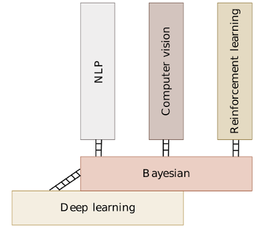

This landing page consists of various repos from my personal research.
I use these templates to get me (re-)started, given some context from my prior work.

## Contents

- [Numerical methods](#numerical-methods)
- [Programming Languages](#programming-languages)
  - [Cpp](#cpp)
  - [Python utilities](#python-utilities)
- [Prescriptive analytics](#prescriptive-analytics)
- [Machine learning](#machine-learning)
- [Wave propagation](#wave-propagation)
- [Back-End Development](#back-end-development)
- [Front-end](#front-end)
- [Development Environment](#development-environment)
- [Basic Grammar](#basic-grammar)
- [Online learning](#online-learning)
- [Learning resources](#learn)

## Numerical methods

- [Tiny C++ library for matrix algebra](https://github.com/prav-nak/pub_Matrix_library.git)
- [Forward automatic differentiation using dual arithmetic](https://github.com/prav-nak/pub_forward-ad)
- [Reverse mode automatic differentiation](https://github.com/prav-nak/pub_reverse_ad)
- [Interval arithmetic](https://github.com/prav-nak/interval-arithmetic)

## Programming languages
### Cpp

- [Lazy evaluation in C++ using Expression templates](https://github.com/prav-nak/pub_expression_templates)

### Python utilities

- Master-Slave job management
  - [Job management using master slave configuration]
- Symbolic math
  - [Arithmetic operations with custom objects using symbolic expressions](https://github.com/prav-nak/pub_symbolic_python)

 ## Prescriptive analytics

- [Business location analysis](https://github.com/prav-nak/pub_WarehouseLocation)
- [Dynamic network flows]

## Wave propagation

- Sensitivity analysis for elastodynamics using spectral elements
  - [Elastodynamics](https://github.com/prav-nak/elastodynamics)
- Perfectly matched layers boundary conditions
  - [Infinite domain boundary condition using PML](https://github.com/prav-nak/PML)

## Machine learning

- [Tensorflow](https://github.com/prav-nak/tensorflow)

- [Deep learning]()
- [Bayesian methods]()
- [Natural language processing]()
- [Computer vision]()
- [Reinforcement learning]()

## Back end development

- [Git guts](https://github.com/prav-nak/git_flashcards)
- [DevEnv using docker](https://github.com/prav-nak/docker_tutorial)
- [Dockerfile for prescriptive analytics with optimization solvers (pyomo, glpk, anaconda)](https://github.com/prav-nak/pyomo_docker)
- [Multicontainer docker app using docker-compose](https://github.com/prav-nak/docker_compose)
- [Containerized vscode development environment](https://github.com/prav-nak/vscode_docker)

## Front end
- [Adding a new blog using Jekyll](https://github.com/prav-nak/adding_jekyll_posts.git)

## Finite elements
- Meshing
  - [GMSH example]
- Quadrature generator
  - [Generate quadrature for numerical integration using Jacobi equation solver for arbitrary order]

## Development environment

- [vim]()
- [tmux]()
- [zsh]()

## Bayesian inference

## Basic grammar
- [Basic grammar for plain english](https://github.com/prav-nak/basic_grammar)

## Online learning

- [Machine learning engineer nandegree - Udacity]()
